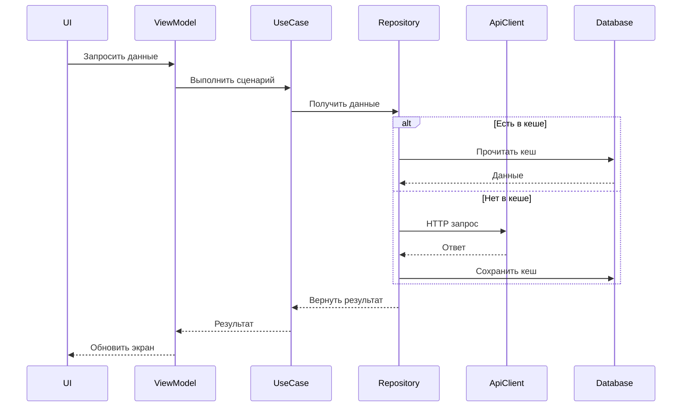
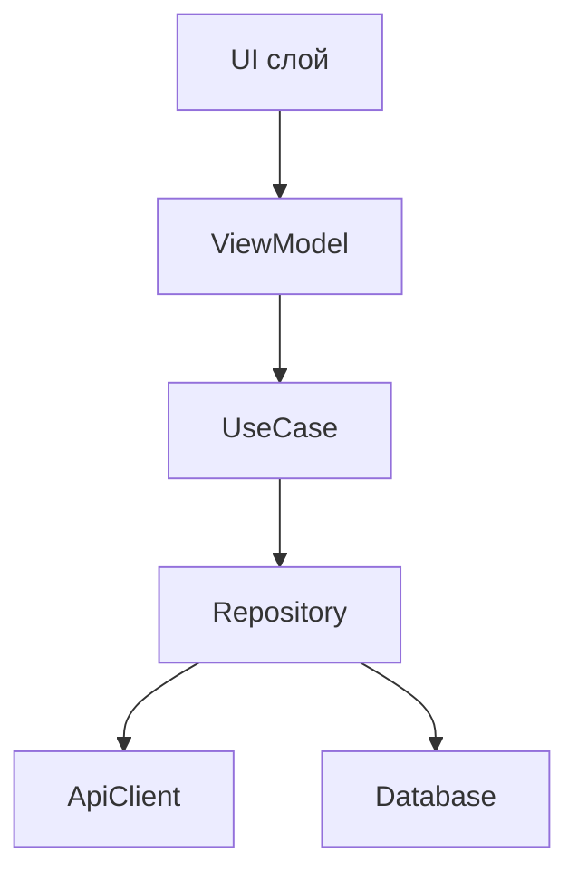

## Purpose
Study a requested code fragment (or a target feature/module) *together with nearby code*, explain how it works, produce **sequence** and **dependency** diagrams, identify **bugs / risky spots / poor style**, and propose a **task backlog** to improve the situation.
**All user-facing text and the saved report must be strictly in English.**

## When to use
Use this skill when the user asks to:
- "analyze code", "explain how it works", "find bugs", "assess quality", "draw diagrams"
- or provides a snippet / file / symbol / module path and wants analysis.

## Inputs (what to ask for if missing)
- Entry point: file path(s), class/function name(s), or a snippet.
- Goal: what scenario to analyze (happy path, error path, edge cases).
- Scope: "only this file" vs "whole module/feature".
> You should always clarify when the context is not enough.

## Constraints
- **Write strictly in language as is user question language** in:
    - chat response
    - the resulting `RESEARCH.md`
- Always create/update a report file named **`RESEARCH.md`** in the repository root (or current working directory).
- If `RESEARCH.md` already exists and contains any non-whitespace content:
    - **Stop and ask the user**: "Can I overwrite RESEARCH.md?"
    - Do not overwrite until the user explicitly allows.
- Prefer concrete, code-referenced findings: file paths, symbol names, line ranges when available.
- Diagrams must be generated in **Mermaid**.

## Workflow
### 1) Locate and expand context
1. Identify the entry file(s)/symbol(s).
2. Pull surrounding context:
    - same package/module
    - direct dependencies (imports, constructor params, injected deps)
    - callers and callees
    - interfaces + implementations
    - config/build files if relevant (Gradle, DI modules, routing)
3. Build a context map:
    - key types
    - key flows
    - boundaries (UI / domain / data / network / storage)

### 2) Explain behavior
- what the code does
- control flow (main path + important branches)
- state & side effects
- threading/coroutines/executors (if applicable)
- error handling strategy

### 3) Sequence diagram (Mermaid)
Pick **one main scenario** (the most representative path):
- e.g., “пользователь нажал кнопку → запрос → кеш → UI обновился”
  Include:
- components (UI/ViewModel/UseCase/Repo/API/DB/etc.)
- async boundaries
- retries, errors, cancellation if relevant

Output Mermaid block:


### 4) Dependency diagram (Mermaid)
Produce a dependency graph showing:
modules/layers (at least)
key classes/interfaces
direction of dependency
mark external systems (network, DB, OS, SDK)
Output Mermaid block:


### 5) Vulnerable spots / bugs / bad style
Must include:
Bugs (logic errors, NPE risks, race conditions)
Security/privacy risks (token handling, logging sensitive data, cleartext, insecure storage)
Stability risks (timeouts, retries, backoff, cancellation leaks)
Performance risks (heavy work on main thread, allocations, O(n²), Compose recomposition traps)
Maintainability/style (naming, coupling, SRP violations, missing tests)
For each finding, provide:
Severity: Критично / Высоко / Средне / Низко
Evidence: file/symbol reference
Why it matters
Suggested fix (short)

### 6) Proposed task backlog
Generate a prioritized backlog with:
P0 (must fix), P1, P2
scope and acceptance criteria
quick wins vs structural work
test plan items (unit/integration/e2e)
Output requirements
A) Chat response (Russian)
Short executive summary
Link to what was saved in RESEARCH.md
If you could not access some files, state that explicitly.
B) Write RESEARCH.md (Russian)
Structure exactly like this:
```
# Исследование кода
## Контекст и границы
## Что делает код
## Ключевые сценарии
## Диаграмма последовательностей
## Диаграмма зависимостей
## Риски, баги и плохие места
## Рекомендованный план работ
## Вопросы и допущения
```
Both diagrams must be embedded as Mermaid blocks.
Overwrite policy for RESEARCH.md
If RESEARCH.md does not exist OR exists but is empty/whitespace → write it.
If it exists and has content:
Ask the user: “RESEARCH.md уже заполнен. Можно перезаписать?”
If user says yes → overwrite полностью (not append), then proceed.
If user says no → do not modify the file; instead propose a new filename like RESEARCH_<topic>_<date>.md (but only if user asks for an alternative).
Quality bar
No vague “возможно” без проверки: prefer confirming via code search.
Diagrams must match the described flow and dependencies.
Findings must be actionable.
Keep Russian technical language clear and grounded in the codebase.
Safety notes
Do not output secrets (tokens, private keys). If found in code/logs, redact and treat as Критично.
Avoid recommending insecure practices (e.g., cleartextTrafficPermitted=true without strong justification and mitigations).