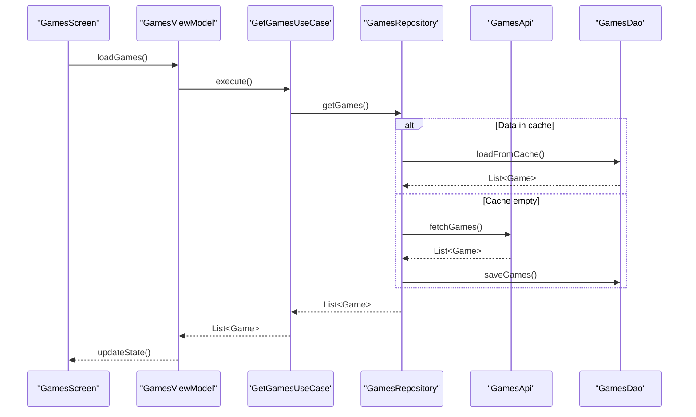
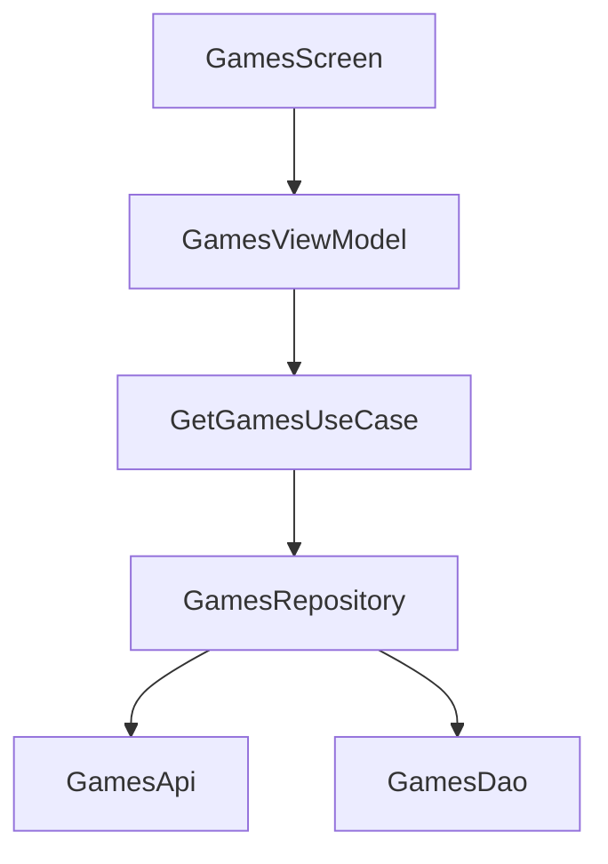

# Code Research

## Context and boundaries

Object of research: game list loading feature.

Entry points:
- GamesScreen
- GamesViewModel
- GetGamesUseCase
- GamesRepositoryImpl
- GamesApi
- GamesDao

Boundaries:
- UI layer: Compose screen + ViewModel
- Domain layer: UseCase
- Data layer: Repository + API + Database
- External systems: HTTP backend, local DB

Architecture style: MVVM + Repository pattern.

---

## What the code does

Scenario:
1. User opens screen.
2. UI calls loadGames() method on ViewModel.
3. ViewModel launches a coroutine.
4. UseCase delegates work to Repository.
5. Repository:
    - first checks cache in DB,
    - if no data or it's stale — executes HTTP request,
    - saves result to DB,
    - returns data up the chain.
6. ViewModel updates state.
7. UI redraws.

Features:
- Uses suspend functions.
- Errors are passed as Result.Error.
- No explicit retry strategy.
- No timeouts at Repository level.

---

## Key scenarios

### 1. Happy path (data in cache)
- Data returns instantly.
- Network not used.

### 2. Cold start (cache empty)
- HTTP request executed.
- Response saved to DB.
- UI updated.

### 3. Network error
- Repository returns error.
- ViewModel passes it to state.
- UI shows snackbar.

---

## Sequence diagram

## Dependency diagram

## Risks, bugs and problem areas
1. No HTTP request timeout
   Severity: High
   Risk: UI hanging on poor network.
   Solution: configure timeout in HTTP client.
2. No retry strategy
   Severity: Medium
   Risk: single network failure breaks UX.
   Solution: add retry with exponential backoff.
3. Repository knows too much
   Severity: Medium
   Risk: SRP violation, testing complexity.
   Solution: extract CacheDataSource and RemoteDataSource.
4. No explicit cache staleness check
   Severity: Medium
   Risk: user may see old data.
   Solution: add timestamp + TTL.
5. No cancellation handling
   Severity: Low
   Risk: work leaks during rapid screen closing.
   Solution: ensure viewModelScope is used.

### Recommended work plan
#### P0
  - Add HTTP timeout.
  - Add IOException handling with clear error.

#### P1
- Extract RemoteDataSource and CacheDataSource.
- Add retry with backoff.

#### P2
- Add cache TTL.
- Cover UseCase with unit tests.
- Cover Repository with integration test.