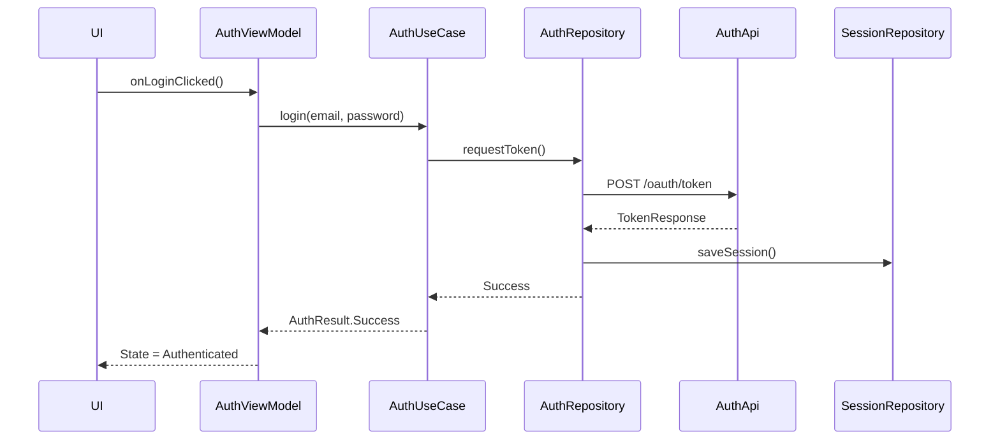
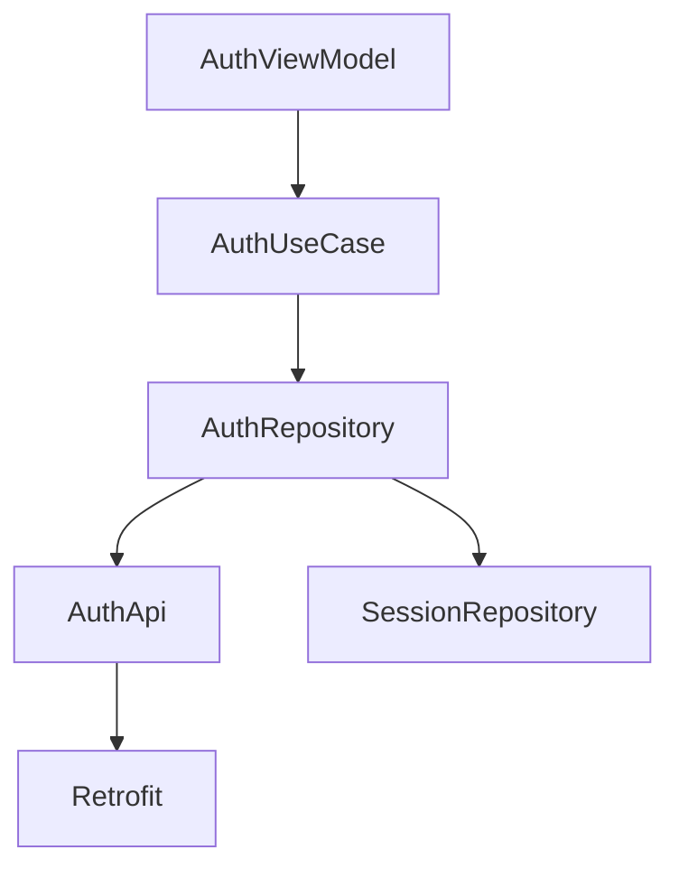

# Code Research

## Context and Boundaries

Object of research: User authorization module (token acquisition, session refresh, token storage).

Entry points:
- AuthViewModel.kt
- AuthUseCase.kt
- AuthRepository.kt
- AuthApi.kt

Boundaries:
- UI layer: Compose login screen + ViewModel
- Domain layer: AuthUseCase
- Data layer: AuthRepository + Retrofit API
- External systems:
    - OAuth backend
    - Secure storage (EncryptedSharedPreferences)

Architecture style: Clean Architecture + MVVM + Hilt DI.

---

## What the code does

Scenario:
1. User enters email and password.
2. AuthViewModel calls AuthUseCase.login().
3. AuthUseCase calls AuthRepository.requestToken().
4. AuthRepository makes a network request via AuthApi.
5. On success, token is saved in SessionRepository.
6. ViewModel updates UI with Authenticated state.

Features:
- Uses coroutines (viewModelScope, Dispatchers.IO)
- Errors are wrapped in sealed class AuthResult
- Tokens are stored in EncryptedSharedPreferences
- Retry is not implemented
- No explicit timeout

---

## Key Scenarios

### 1. Successful authorization (Happy Path)
- HTTP 200
- access_token and refresh_token received
- Session saved
- UI transitions to main screen

### 2. Wrong password
- HTTP 401
- Error is mapped to AuthResult.InvalidCredentials
- UI shows snackbar

### 3. No network
- IOException
- Error is thrown as AuthResult.NetworkError
- Retry is not provided

### 4. Expired refresh_token
- HTTP 400
- User is logged out
- Session cleared

---

## Sequence Diagram

## Dependency Diagram

## Risks, Bugs and Problem Areas

| Problem | Severity | Evidence | Why it matters | Suggested fix |
|----------|----------|----------|----------------|---------------|
| Retrofit timeout missing | High | RetrofitModule.kt: provideRetrofit() | Hanging request can block thread and degrade UX | Add OkHttpClient with connect/read/write timeout |
| Missing retry on network error | Medium | AuthRepository.kt: requestToken() | Temporary network failures lead to login failure | Add retry(1-2) with exponential delay |
| Token stored in ViewModel memory | High | AuthViewModel.kt: private var token: String | Risk of token leakage during logging or crash reporting | Store token only in SessionRepository |
| No cancellation handling | Medium | AuthUseCase.kt: withContext(Dispatchers.IO) | Possible coroutine leak when leaving screen | Use structured concurrency and check isActive |
| No logging of failed attempts | Low | telemetry missing | Difficult to analyze real causes of failures | Add analytics event for authorization errors |

## Recommended Work Plan

| Priority | Task | Description | Acceptance criteria |
|----------|--------|----------|---------------------|
| P0 | Add timeouts to network layer | Configure OkHttpClient with connect/read/write timeout 15–30s | Timeout fires on slow response; UI receives proper error |
| P0 | Remove token storage in ViewModel | Leave token only in SessionRepository | ViewModel contains no sensitive data; token is not logged |
| P1 | Add retry on network error | Implement retry(2) with exponential delay | On temporary network loss, authorization recovers |
| P1 | Add error logging | Send authorization error events to analytics | Login errors are captured in telemetry |
| P2 | Add unit tests for AuthUseCase | Cover happy path and error path | Use case coverage at least X%; tests pass in CI |
| P2 | Add integration test with MockWebServer | Test real HTTP flow | Successful validation of 200, 401, timeout scenarios |